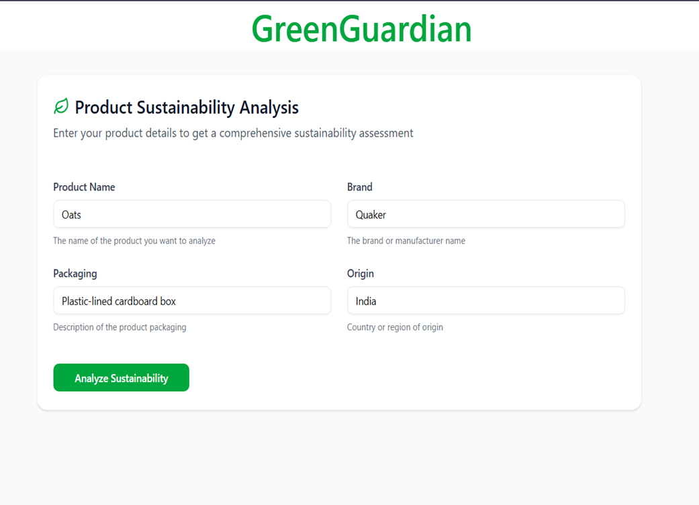
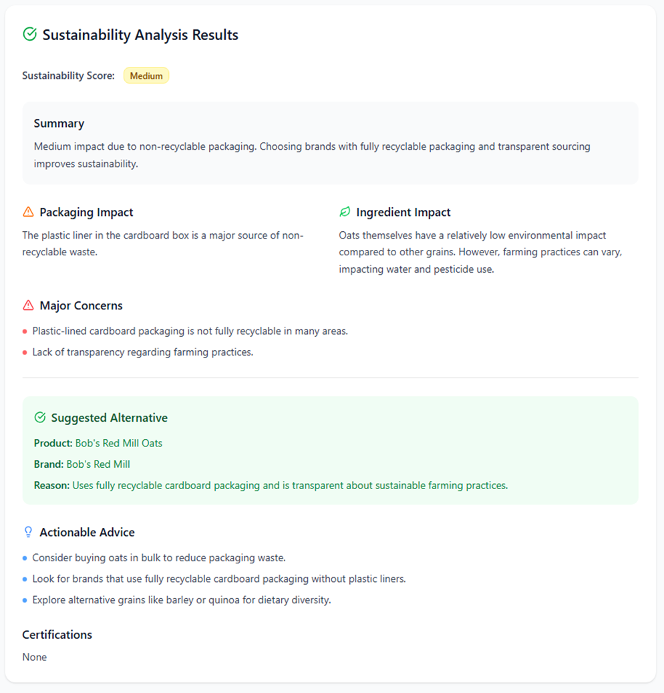
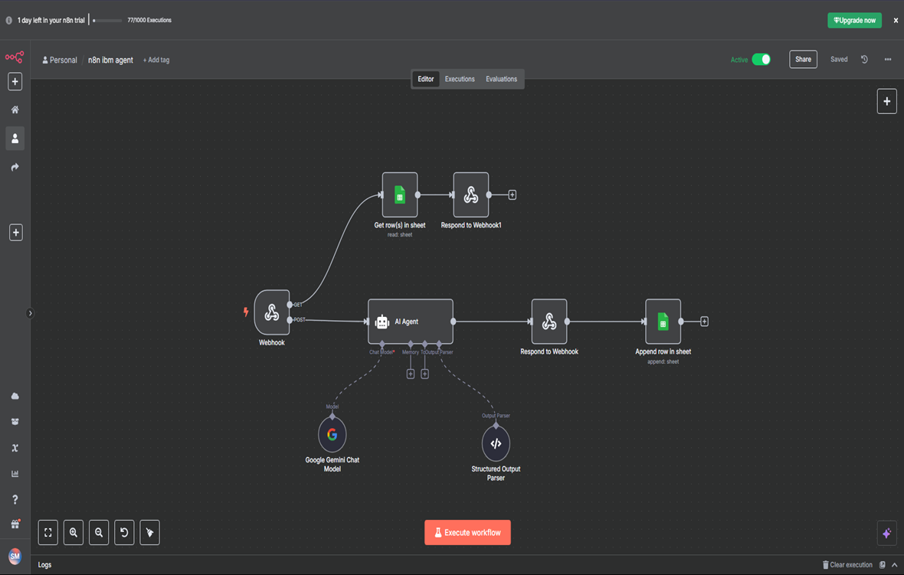
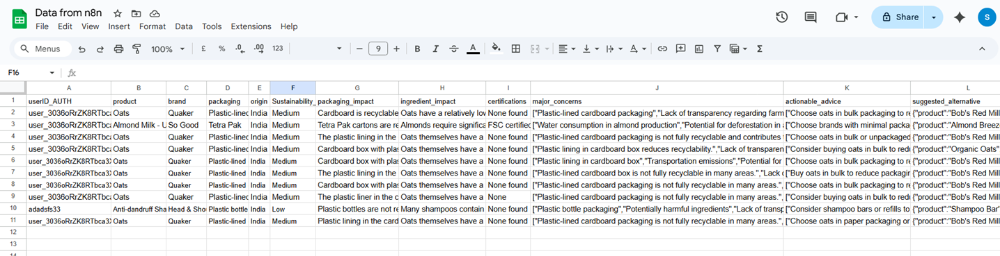

# 🌱 GreenGuardian – AI Agent for Sustainable Product Insight

**GreenGuardian** is an AI-powered web solution that promotes **sustainable consumption** by analyzing consumer product data and recommending **eco-friendly alternatives**. The system combines **automation (n8n workflows)**, **AI reasoning (Gemini model)**, and **open data (Open Food Facts API)** to provide **real-time sustainability scores** and actionable insights.

## Here are some glimps of GreenGuradian

## 🚀 Features
- **Real-time Sustainability Scoring** – Evaluates packaging, ingredients, and certifications.
- **AI-based Product Analysis** – Uses Gemini reasoning for structured evaluation.
- **Eco-friendly Alternatives** – Suggests greener substitutes for consumer products.
- **Open Data Integration** – Powered by Open Food Facts API for transparency.
- **Scalable & Integration-ready** – Easily connects with any frontend.
- **Educational & Consumer-friendly** – Encourages responsible consumption in line with SDG 12.

## ⚙️ Tech Stack
- **Frontend:** Next.js
- **Backend:** n8n (No-code workflow automation)
- **AI Model:** Gemini (via API)
- **APIs:** Open Food Facts, Gemini
- **Hosting (recommended):** Vercel (frontend), n8n cloud / self-hosted instance (backend)

## 📊 Workflow Example

1. User submits product details through the frontend form.
2. n8n receives the webhook and queries the Open Food Facts API for product metadata.
3. The fetched data (packaging, ingredients, labels) is passed to the Gemini model for evaluation.
4. Output returned to frontend:
   - **Sustainability Score** (numeric or categorical)
   - **Impact Summary** (human-readable reasoning)
   - **Alternative Suggestions** (linked to greener products)

## 📚 References
- UN SDG 12 – Responsible Consumption & Production
- Open Food Facts API: https://world.openfoodfacts.org/data
- n8n Documentation: https://docs.n8n.io/

## 🤝 Contributing
Contributions and improvements are welcome. Please fork the repo, create a feature branch, and submit a pull request. Include descriptive commits and tests where applicable.

## 📜 License
MIT License © 2025 Smit Patel
